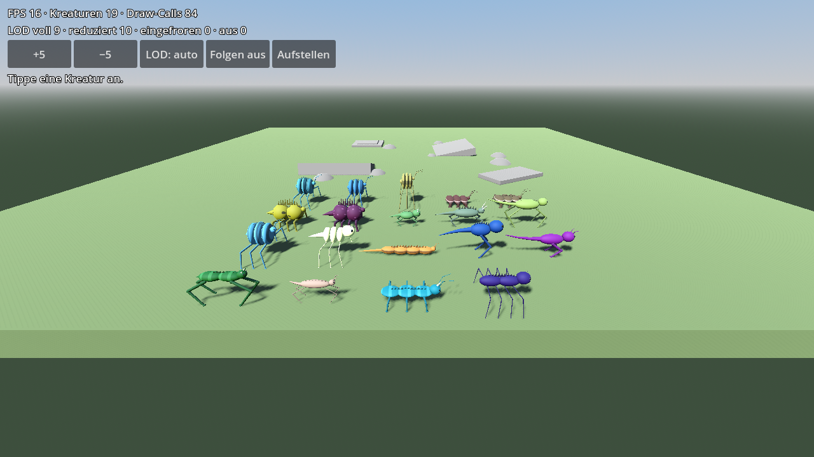
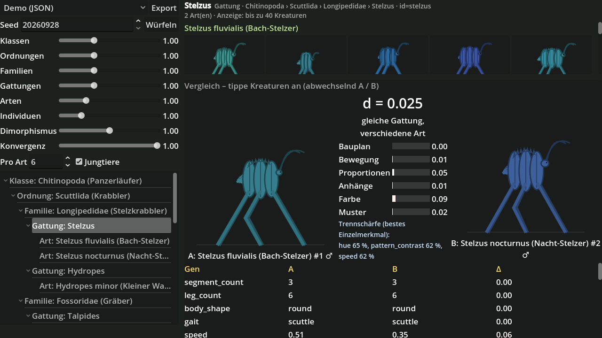

# Creature Learning

Godot-4-Spiel für Android: Der Spieler lebt in einer Gruppe prozedural erzeugter Kreaturen, erschließt
deren Art und Fähigkeiten durch Beobachtung und weist ihnen in kurzen Aufgaben passende Rollen zu.

**Stand: Meilenstein 2** – Genom und Taxonomie (M1), prozedurale 3D-Kreaturen mit IK-Laufen und LOD (M2).

| Meilenstein | Inhalt | Status |
|---|---|---|
| 1 | Genom, Taxonomie, Tests, Debug-Viewer | ✅ |
| 2 | Prozedurales Mesh, IK-Laufen | ✅ |
| 3 | Welt mit Spatial Gardener, Touch-Kamera | – |
| 4 | Fähigkeiten, Kontext, sichtbares Verhalten | – |
| 5 | Journal, erste Aufgabe | – |
| 6 | Android-Export, Performance | – |





## Voraussetzungen

- Godot **4.4.x** (getestet: 4.4.1 stable)
- Test-Framework GUT 9.4.0 liegt bereits unter `addons/gut`

## Starten

Projekt im Godot-Editor öffnen und F5 drücken. Das Startmenü (`scenes/main.tscn`) führt zu den
Debug-Szenen; oben rechts gibt es überall einen „Menü“-Knopf (Esc / Android-Zurück geht auch).

- **Kreaturen-Labor** (`scenes/debug/creature_lab.tscn`, M2): alle Baupläne laufen als 3D-Kreaturen
  mit IK über unebenen Boden. Ziehen = drehen, Pinch/Mausrad = zoomen, zwei Finger/rechte
  Maustaste = verschieben, Antippen = Kreatur auswählen (Kamera folgt). Knöpfe: +5/−5,
  LOD erzwingen, Aufstellen. Anzeige: FPS, Draw-Calls, Kreaturen je LOD-Stufe.
- **Taxonomie-Viewer** (`scenes/debug/taxonomy_viewer.tscn`, M1):
  - links: Quelle (Demo-JSON oder generiert), Seed, Regler für die Streuung pro Rang,
    Dimorphismus und Konvergenz, darunter der Taxonomie-Baum (≈ markiert konvergente Taxa)
  - rechts oben: Kreaturen des gewählten Taxons (Glyphen in einheitlichem Maßstab)
  - rechts unten: Vergleich – Kreaturen antippen (abwechselnd A/B) → Distanz, Aufschlüsselung
    nach Merkmalsgruppen, Gen-Tabelle
  - „Export“ schreibt die aktuelle Taxonomie als JSON nach `user://`
- **Genom-Vergleich** (`scenes/debug/genome_compare.tscn`): eigenständiger Vergleichsmodus mit
  Schnellwahl (gleiche Art, Gattung, Familie, andere Klasse, Konvergenzpaar, ♂/♀, Alt/Jung).

## Tests

```bash
godot --headless --import                      # einmalig bzw. nach neuen Klassen
godot --headless -s addons/gut/gut_cmdln.gd    # nutzt .gutconfig.json (tests/unit)
```

CPU-Zeit der Kreaturen messen:

```bash
godot --headless -s tools/benchmark_creatures.gd -- anzahl=20 frames=600
```

Screenshot einer Szene (z. B. im Container ohne Bildschirm):

```bash
xvfb-run -s "-screen 0 1280x720x24" godot --rendering-driver opengl3 \
  -s tools/screenshot.gd -- res://scenes/debug/taxonomy_viewer.tscn out.png 30 select=squamopoda
```

## Inhalte ohne Code erweitern

- Gene: [`docs/genome_parameters.md`](docs/genome_parameters.md) → `data/genome_schema.json`
- Taxa, Dimorphismus, Konvergenz, Generator: [`docs/taxonomy_format.md`](docs/taxonomy_format.md) → `data/taxonomies/`, `data/generator_presets/`
- Mesh, Skelett, Gangarten, LOD, Performance: [`docs/creature_rendering.md`](docs/creature_rendering.md)
- Architektur und Module: [`docs/architecture.md`](docs/architecture.md)
- Roadmap mit allen Meilensteinen: [`docs/roadmap.md`](docs/roadmap.md)

## Ordnerstruktur

```
addons/gut/            Test-Framework
data/                  Schema, Taxonomien, Generator-Presets (JSON)
docs/                  Dokumentation
scenes/                Startmenü (main.tscn) und Debug-Szenen
src/core/              Ränge, Seeds, JSON
src/genome/            Gen-Definitionen, Genom, Distanz
src/taxonomy/          Taxonomie, Loader, Generator, Individuen, Dimorphismus, Konvergenz
src/creature/          BodyPlan, Rig, Creature-Node, LOD, Platzhalter-Verhalten
src/mesh/              Mesh-Builder und Shader
src/locomotion/        IK, Schrittmuster, Schrittplaner
src/camera/            Orbit-Kamera
src/debug/             Menü, Viewer, Glyphen, Vergleich, Labor
tests/unit/            GUT-Tests
tools/                 Hilfsskripte (Screenshot, Benchmark)
```
