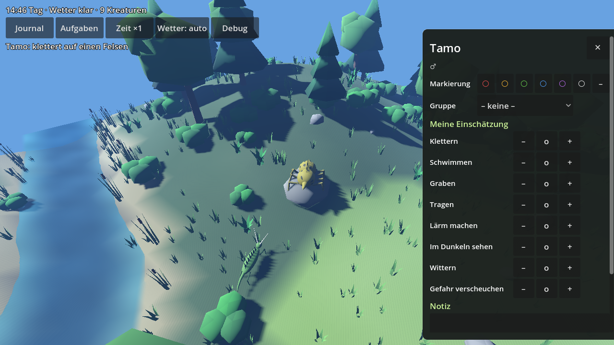
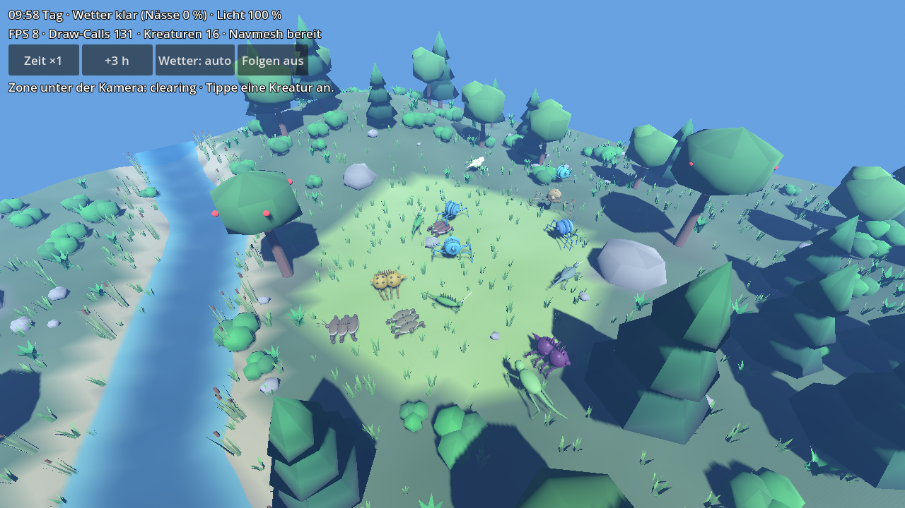

# Creature Learning

Godot-4-Spiel für Android: Der Spieler lebt in einer Gruppe prozedural erzeugter Kreaturen, erschließt
deren Art und Fähigkeiten durch Beobachtung und weist ihnen in kurzen Aufgaben passende Rollen zu.

**Stand: Meilenstein 6** – Genom und Taxonomie (M1), prozedurale 3D-Kreaturen mit IK-Laufen (M2), Waldwelt mit Spatial Gardener, Tageszeit und Wetter (M3), Fähigkeiten und sichtbares Verhalten (M4), Journal, Spielstand und spielbare Aufgaben (M5), Export für Web, Android und iOS (M6).

| Meilenstein | Inhalt | Status |
|---|---|---|
| 1 | Genom, Taxonomie, Tests, Debug-Viewer | ✅ |
| 2 | Prozedurales Mesh, IK-Laufen | ✅ |
| 3 | Welt mit Spatial Gardener, Touch-Kamera | ✅ |
| 4 | Fähigkeiten, Kontext, sichtbares Verhalten | ✅ |
| 5 | Journal, erste Aufgabe | ✅ |
| 6 | Export (Web, Android, iOS), Performance | ✅ (Gerätemessung offen) |






## Spielen

- **Browser / iPhone:** Web-Version über GitHub Pages (nach Einrichtung, siehe `docs/export.md`)
  oder lokal exportieren. Im Handy-Browser „Zum Home-Bildschirm“ hinzufügen.
- **Android:** Debug-APK aus dem GitHub-Actions-Lauf (*Artifacts*) herunterladen und installieren.
- **iOS nativ:** Preset vorbereitet, Build braucht einen Mac mit Xcode.

## Voraussetzungen

- Godot **4.4.x** (getestet: 4.4.1 stable)
- Test-Framework GUT 9.4.0 liegt bereits unter `addons/gut`

## Starten

Projekt im Godot-Editor öffnen und F5 drücken. Das Spiel startet direkt in der Waldwelt; die
Debug-Szenen erreicht man über *Optionen → Debug → Entwicklermenü* (dort oben rechts „Menü“,
Esc / Android-Zurück geht auch).

- **Waldwelt** (`scenes/world/forest.tscn`) – das eigentliche Spiel: Gelände mit Bach, Lichtung,
  Felsen und Fruchtbäumen, Wetter; im Lager kann man den Kreaturen jederzeit zuschauen. Ein neues
  Spiel beginnt mit einer kurzen Einführung und 6 Kreaturen (3 Arten, zwei davon Doppelgänger).
  - **Runden:** Eine Saison hat 7 Runden mit je vier Phasen; der Knopf oben (z. B. „Probe (2)“,
    „Aufgabe wählen“) und „Weiter ›“ führen hindurch:
    1. **Zug der Rivalen** – die Moosläufer versuchen ihre Aufgaben auf der Bühne (überspringbar),
       danach eine Übersicht.
    2. **Proben** (2 pro Runde): Probe wählen (Klettern, Bach, Spüren, Nacht, Graben, Tragen, Rufen,
       Mut), dann in der Galerie die Kreatur. Auf der beleuchteten **Bühne** zeigt sie in einem
       eindeutigen Moment, wie weit sie kommt (Stufe ○○○ bis ●●●); danach gleich die eigene
       Einschätzung festhalten.
    3. **Aufgabe** – eines der Angebote der Runde wählen, Rollenplatz antippen, in der **Galerie**
       die Kreatur wählen (Karten mit Bild, eigener Einschätzung und Probenergebnis; Filter Gruppe /
       Fremde), starten. Die Aufgabe läuft auf der Bühne Abschnitt für Abschnitt ab. Jeder Versuch
       kostet Proviant, der erste Versuch zahlt doppelt, wer scheitert, ist bis zur nächsten Runde
       erschöpft. 9 Aufgaben werden nacheinander frei.
    4. **Abend** – **Artfrage** („dieselbe Art?“, füllt das **Bestimmungsbuch** im Journal),
       Ergebnisse der Runde, Punktestand, Erholung über Nacht, „Nächste Runde ›“.
  - **Kreatur antippen** → Leiste unten mit vermuteter Art, Einschätzung (▲ ausklappen), Proben, Beobachtungen; ‹ › blättert durch alle Kreaturen.
  - **Anheuern**: Fremde am Waldrand beobachten und für Beeren in die Gruppe holen.
  - **Rivalen**: Die Moosläufer sammeln am anderen Ufer um dieselben (knappen) Vorräte; oben rechts
    steht der Punktestand. Nach 7 Runden Schlusswertung mit Vorschlag für die nächste Schwierigkeit.
  - **Optionen**: Gegner (Schwierigkeit), Ton, Namen, Textgröße, Debug.
  Der Spielstand wird automatisch gespeichert.
- **Kreaturen-Labor** (`scenes/debug/creature_lab.tscn`, M2): alle Baupläne laufen als 3D-Kreaturen
  mit IK über unebenen Boden. Ziehen = drehen, Pinch/Mausrad = zoomen, zwei Finger/rechte
  Maustaste = verschieben, Antippen = Kreatur auswählen (Kamera folgt). Knöpfe: +5/−5,
  LOD erzwingen, Aufstellen. Anzeige: FPS, Draw-Calls, Kreaturen je LOD-Stufe.
- **Taxonomie-Viewer** (`scenes/debug/taxonomy_viewer.tscn`, M1):
  - links: Quelle (Demo-JSON oder generiert), Seed, Regler für die Streuung pro Rang,
    Dimorphismus und Konvergenz, darunter der Taxonomie-Baum (≈ markiert konvergente Taxa)
  - rechts oben: Kreaturen des gewählten Taxons (Glyphen in einheitlichem Maßstab)
  - rechts unten: Vergleich – Kreaturen antippen (abwechselnd A/B) → Distanz, Aufschlüsselung
    nach Merkmalsgruppen, Gen-Tabelle
  - „Export“ schreibt die aktuelle Taxonomie als JSON nach `user://`
- **Genom-Vergleich** (`scenes/debug/genome_compare.tscn`): eigenständiger Vergleichsmodus mit
  Schnellwahl (gleiche Art, Gattung, Familie, andere Klasse, Konvergenzpaar, ♂/♀, Alt/Jung).

## Tests

```bash
godot --headless --import                      # einmalig bzw. nach neuen Klassen
godot --headless -s addons/gut/gut_cmdln.gd    # nutzt .gutconfig.json (tests/unit)
```

Waldszene neu erzeugen (nach Änderungen an `data/world/forest.json`):

```bash
godot --headless -s tools/build_forest.gd -- --regrow   # nur Vegetation
godot --headless -s tools/build_forest.gd -- --force    # ganze Szene
```

CPU-Zeit der Kreaturen messen:

```bash
godot --headless -s tools/benchmark_creatures.gd -- anzahl=20 frames=600
```

Screenshot einer Szene (z. B. im Container ohne Bildschirm):

```bash
xvfb-run -s "-screen 0 1280x720x24" godot --rendering-driver opengl3 \
  -s tools/screenshot.gd -- res://scenes/debug/taxonomy_viewer.tscn out.png 30 select=squamopoda
```

## Inhalte ohne Code erweitern

- Gene: [`docs/genome_parameters.md`](docs/genome_parameters.md) → `data/genome_schema.json`
- Taxa, Dimorphismus, Konvergenz, Generator: [`docs/taxonomy_format.md`](docs/taxonomy_format.md) → `data/taxonomies/`, `data/generator_presets/`
- Aufgaben, Journal, Spielstand, Fortschritt: [`docs/tasks_format.md`](docs/tasks_format.md) → `data/tasks/`, `data/game/`
- Fähigkeiten, Kontext, Verhalten, Polymorphismus, Trennschärfe: [`docs/abilities_format.md`](docs/abilities_format.md) → `data/abilities/`
- Welt-Layout, Vegetationsregeln, Startgruppe: [`docs/world_format.md`](docs/world_format.md) → `data/world/`
- Spatial Gardener (Version, Einrichtung, Build-Tool): [`docs/spatial_gardener.md`](docs/spatial_gardener.md)
- Export (Web, Android, iOS), CI, Leistung messen: [`docs/export.md`](docs/export.md)
- Mesh, Skelett, Gangarten, LOD, Performance: [`docs/creature_rendering.md`](docs/creature_rendering.md)
- Architektur und Module: [`docs/architecture.md`](docs/architecture.md)
- Roadmap mit allen Meilensteinen: [`docs/roadmap.md`](docs/roadmap.md)

## Ordnerstruktur

```
addons/gut/            Test-Framework
addons/dreadpon.spatial_gardener/  Vegetations-Plugin (MIT)
assets/vegetation/     erzeugte Low-Poly-Pflanzen (build_forest.gd)
data/                  Schema, Taxonomien, Generator-Presets (JSON)
docs/                  Dokumentation
scenes/                Waldwelt (Startszene), Entwicklermenü (main.tscn) und Debug-Szenen
src/core/              Ränge, Seeds, JSON
src/genome/            Gen-Definitionen, Genom, Distanz
src/taxonomy/          Taxonomie, Loader, Generator, Individuen, Dimorphismus, Konvergenz
src/creature/          BodyPlan, Rig, Creature-Node, LOD, Platzhalter-Verhalten
src/mesh/              Mesh-Builder und Shader
src/locomotion/        IK, Schrittmuster, Schrittplaner
src/abilities/         Fähigkeitskatalog und -profil
src/behaviors/         Verhaltensgehirn, Verhaltensweisen, Effekte
src/game/              Spielstand, Gruppe, Rekrutierung, Grafikstufen, Leistungsmessung
src/journal/           Beobachtungs-Journal
src/tasks/             Aufgaben: Format, Bewertung, Wiedergabe
src/ui/                Karte, Journal, Aufgabenwahl, Auswertung
src/camera/            Touch-/Orbit-Kamera
src/world/             Layout, Gelände, Vegetation, Tageszeit, Wetter, Kontext, Navigation
src/debug/             Menü, Viewer, Glyphen, Vergleich, Labor
tests/unit/            GUT-Tests
tools/                 Hilfsskripte (Screenshot, Benchmark, Welt-Build)
assets/fonts/          Projektschrift DejaVu Sans (freie Lizenz)
.github/workflows/     CI: Tests, Web- und Android-Export, GitHub Pages
export_presets.cfg     Export-Presets Web, Android, iOS
```
